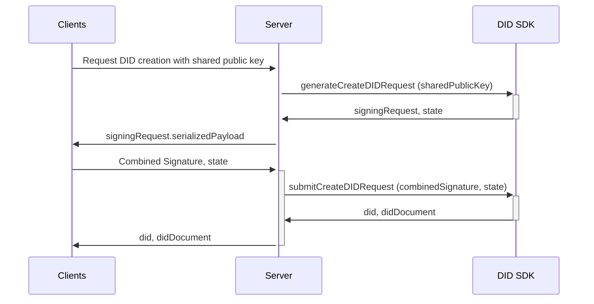
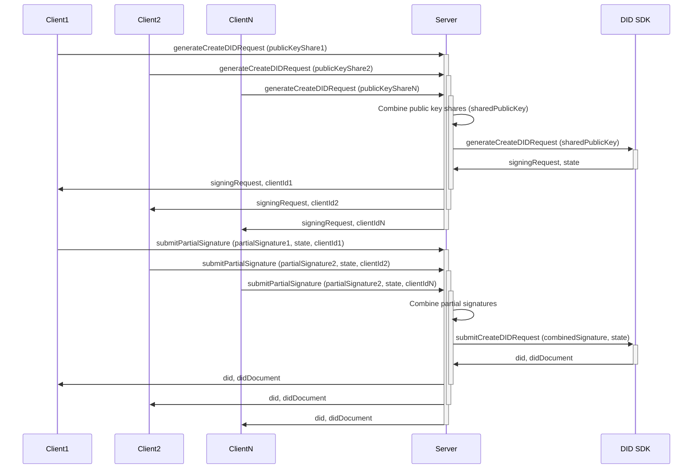

## **DID Management with Multisig, TSS, and CMSM**

This document outlines two distinct approaches for managing Decentralized Identifiers (DIDs), both leveraging the security of multi-signature ownership and the flexibility of threshold signature schemes (TSS) within the framework of Client Managed Secret Mode (CMSM). These approaches cater to different needs and preferences for key management and signature combination, enabling secure and efficient DID operations such as creation, update, and deactivation.

The first approach, **Client-Side TSS with Server-Side CMSM**, prioritizes client-side control by delegating all TSS operations to the clients, while the server focuses on managing the CMSM interactions.

The second approach, **Server-Assisted Multisig with TSS and CMSM**, offers a more balanced approach where clients manage their key shares, and the server facilitates the combination of public key shares and partial signatures, streamlining the process and potentially enhancing security.

Both approaches offer robust mechanisms for managing DIDs, and the choice between them depends on factors such as the desired level of client-side control, trust in the server, and the overall complexity of the system.

**Constraints**

These solutions are constrained by the following aspects of the Hedera DID Method specification and the TSS ecosystem:

* **Ed25519-based TSS:** The Hedera DID Method currently requires the Ed25519 signature algorithm. Any TSS library used must be based on Ed25519 for compatibility.
* **Single Controller:** The Hedera DID Method currently only supports a single controller for a DID. This means that even though multiple parties might hold key shares, they collectively represent a single controlling entity for the DID. This impacts the design of multisig solutions, as they need to operate within this constraint.
* **TSS Library Availability:** While TSS is a powerful technology, the most advanced and popular TSS libraries are primarily written in Rust or Go. If implementing TSS in a JavaScript environment, you will likely require Foreign Function Interfaces (FFI) or WebAssembly (WASM) to interact with these libraries. This adds an additional layer of complexity to the integration process.

### **Approach 1: Client-Side TSS with Server-Side CMSM**

This approach prioritizes client-side control by having the clients perform all TSS operations, including key generation, share distribution, and signature combination. The server interacts with the clients as if they were a single entity, receiving a combined public key and a combined signature for DID creation. This can be implemented either using a trusted dealer to generate and distribute the key shares or through a Distributed Key Generation (DKG) protocol for a more decentralized and trustless setup.

**General Flow (for `createDID`)**

1.  **Client-Side Key Management and Combination:**
    *   Clients generate their key shares and exchange public key shares using a TSS library of their choice (TSS-agnostic). This can be done through a trusted dealer or DKG.
    *   Clients combine their public key shares into a single `sharedPublicKey`.
    *   Clients send the `sharedPublicKey` to the server with a request to create the DID.

2.  **Server-Side Request Handling:**
    *   The server receives the `sharedPublicKey` and forwards it to the DID SDK's `generateCreateDIDRequest` function.
    *   The DID SDK generates a `signingRequest` and a `state` object and returns them to the server.
    *   The server sends the `signingRequest.serializedPayload` to the clients.

3.  **Client-Side Signing and Combination:**
    *   Clients receive the `signingRequest.serializedPayload` from the server.
    *   Each client generates a partial signature of the payload using its key share.
    *   Clients communicate with each other to exchange their partial signatures.
    *   Clients combine the partial signatures into a single `combinedSignature`.
    *   Clients send the `combinedSignature` and the `state` object to the server.

4.  **DID Creation and Finalization:**
    *   The server receives the `combinedSignature` and the `state` object.
    *   The server forwards the `combinedSignature` and `state` to the DID SDK's `submitCreateDIDRequest` function.
    *   The DID SDK processes the request, creating the DID and its corresponding DID Document.
    *   The server sends the newly created DID and DID Document to the clients.

**Detailed Flow Diagram (for `createDID`)**



**Code Snippet (JavaScript - Approach 1)**

```javascript
// Client-side
async function createDID() {
  // 1. Generate key share.
  const keyShare = await generateKeyShare();

  // 2. Get shared public key (clients need to communicate to exchange public key shares).
  const sharedPublicKey = await getSharedPublicKey(); 

  // 3. Send the shared public key to the server to initiate DID creation.
  const { signingRequest, state } = await sendToServer({
    type: 'generateCreateDIDRequest',
    sharedPublicKey,
  });

  // 4. Generate partial signature.
  const partialSignature = await sign(signingRequest.serializedPayload, keyShare);

  // 5. Combine signatures (clients need to communicate to exchange partial signatures).
  const combinedSignature = await combineSignatures(partialSignatures);

  // 6. Send the combined signature and state to the server.
  return await sendToServer({
    type: 'submitCombinedSignature',
    combinedSignature,
    state,
  });
}

// Server-side
async function handleGenerateCreateDIDRequest(sharedPublicKey) {
  // 1. Generate the signing request.
  const { signingRequest, state } = await generateCreateDIDRequest({ sharedPublicKey });

  // 2. Return the signing request and state.
  return { signingRequest, state };
}

async function handleSubmitCombinedSignature(combinedSignature, state) {
  // 1. Submit the combined signature and state to create the DID.
  const { did, didDocument } = await submitCreateDIDRequest({ state, signature: combinedSignature });

  // 2. Return the DID and DID Document.
  return { did, didDocument };
}
```

### **Approach 2: Server-Assisted Multisig with TSS and CMSM**

This approach involves a more active role for the server in the multisig process. While clients still manage their key shares, the server facilitates the combination of both public key shares and partial signatures.

**General Flow (for `createDID`)**

1.  **Client-Side Key Management and Request:**
    *   Clients proactively generate their key shares using a TSS library of their choice (TSS-agnostic).
    *   Clients initiate the DID creation process by sending a `generateCreateDIDRequest` message to the server, including their individual public key shares.

2.  **Server-Side Request Handling and Key Combination:**
    *   Upon receiving the `generateCreateDIDRequest` messages, the server combines the public key shares from all clients into a single shared public key.
    *   The server uses the combined shared public key to generate a `signingRequest` and a `state` object via the `generateCreateDIDRequest` function of the DID SDK.
    *   The server also generates a unique `clientId` for each client and includes it in the response.

3.  **Distribution and Partial Signing:**
    *   The server sends the `signingRequest` and `clientId` to each client.
    *   Each client generates a partial signature using its key share.
    *   Each client sends a `submitPartialSignature` message to the server, including the partial signature, the `state` object, and its `clientId`.

4.  **Server-Side Signature Handling and DID Creation:**
    *   The server receives the `submitPartialSignature` messages from the clients and stores the partial signatures, associating them with the corresponding `clientId`.
    *   The server verifies the validity of each received partial signature and waits until it has collected all the required signatures.
    *   Once all signatures are collected, the server combines them into a single threshold signature.
    *   The server submits the combined threshold signature and the `state` object to the DID SDK using the `submitCreateDIDRequest` function.
    *   The DID SDK processes the request, creating the DID and its corresponding DID Document.
    *   The server sends the newly created DID and DID Document to the clients.

**Note:** The flow for other DID operations (e.g., `updateDID`, `deactivateDID`) follows a similar structure in both solutions, with key differences in the initiation, key generation (if required), and the specific DID SDK functions used.

**Detailed Flow Diagram (for `createDID`)**



**Code Snippet (JavaScript - Approach 2)**

```javascript
// Client-side
async function createDID() {
  // 1. Generate key share.
  const keyShare = await generateKeyShare(); 

  // 2. Request signing data from the server, sending the public key share.
  const { signingRequest, clientId } = await sendToServer({
    type: 'generateCreateDIDRequest',
    publicKeyShare: keyShare.publicKey, // Send only the public key share
  });

  // 3. Generate the partial signature using the key share.
  const partialSignature = await sign(signingRequest.serializedPayload, keyShare);

  // 4. Send the partial signature to the server and wait for the DID.
  return await sendToServer({
    type: 'submitPartialSignature',
    partialSignature,
    state: signingRequest.state,
    clientId,
  });
}

// Server-side
const publicKeys = {}; 
const partialSignatures = {};
const threshold = 2; // Define the number of required signatures.

async function handleGenerateCreateDIDRequest(publicKeyShare, clientId) {
  // 1. Store the public key share, associating it with the client ID.
  publicKeys[clientId] = publicKeyShare;

  // 2. Check if enough public keys have been collected.
  if (Object.keys(publicKeys).length >= threshold) {
    // 3. Combine the public key shares into a shared public key.
    const sharedPublicKey = await combinePublicKeys(Object.values(publicKeys));

    // 4. Generate the signing request.
    const { signingRequest, state } = await generateCreateDIDRequest({ sharedPublicKey });

    // 5. Store the state with the client ID.
    partialSignatures[clientId] = { state };

    // 6. Return the signing request and client ID.
    return { signingRequest, clientId };
  }

  // Not enough public keys yet, return a pending message.
  const remainingKeys = threshold - Object.keys(publicKeys).length;
  return {
    status: 'pending',
    message: `Waiting for ${remainingKeys} more public key(s).`,
  };
}

async function handleSubmitPartialSignature(partialSignature, clientId) {
  // 1. Retrieve the state from the stored partial signatures.
  const state = partialSignatures[clientId].state;

  // 2. Store the partial signature, associating it with the client ID.
  partialSignatures[clientId].signature = partialSignature;

  // 3. Check if enough signatures have been collected.
  if (Object.keys(partialSignatures).length >= threshold) {
    // 4. Combine the partial signatures into a single signature.
    const combinedSignature = await combinePartialSignatures(
      Object.values(partialSignatures).map((item) => item.signature),
      state,
    );

    // 5. Submit the combined signature and state to create the DID.
    const { did, didDocument } = await submitCreateDIDRequest({ state, signature: combinedSignature });

    // 6. Reset the public keys and partial signatures for future requests.
    publicKeys = {};
    partialSignatures = {};

    // 7. Return the DID and DID Document.
    return { did, didDocument };
  }

  // Not enough signatures yet, return a pending message.
  const remainingSignatures = threshold - Object.keys(partialSignatures).length;
  return {
    status: 'pending',
    message: `Waiting for ${remainingSignatures} more signature(s).`,
  };
}

async function handleServerMessage(message) {
  if (message.type === 'generateCreateDIDRequest') {
    const clientId = generateUUID(); // Generate client ID upon receiving the request
    const response = await handleGenerateCreateDIDRequest(message.publicKeyShare, clientId);
    sendToClient(response, clientId);
  } else if (message.type === 'submitPartialSignature') {
    const clientId = message.clientId;
    const result = await handleSubmitPartialSignature(message.partialSignature, clientId);
    if (result) {
      sendDIDToClients(result);
    }
  }
}
```

### **Use Cases**

* **Know Your Business (KYB) with Multisig DID:**  In a KYB scenario, an organization's identity is represented by its DID. Multiple authorized representatives within the organization hold key shares that collectively control the DID. When the organization needs to verify its identity with a relying party, these representatives participate in a multi-signature process to authorize the verification. This ensures that no single individual can compromise the organization's identity and provides a robust audit trail of the KYB verification process.  The organization is effectively the sum of its verified individuals, with the multisig DID representing this collective identity.

* **Key Rotation:** Key rotation is crucial for maintaining the long-term security of a DID, especially in the face of potential key compromise or personnel changes within an organization. Multisig with TSS enables secure and efficient key rotation. By proactively generating new key shares and using the existing shares to authorize the update, organizations can seamlessly transition to a new set of keys without disrupting the functionality of their DID. This proactive approach ensures the ongoing security and integrity of the decentralized identity system.